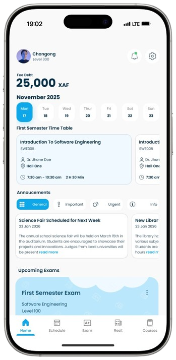
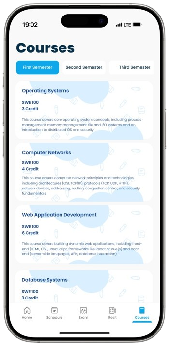

# Welcome to your Expo app 👋

This is an [Expo](https://expo.dev) project created with [`create-expo-app`](https://www.npmjs.com/package/create-expo-app).

## Get started

1. Install dependencies

   ```bash
   npm install
   ```

2. Start the app

   ```bash
   npx expo start
   ```

In the output, you'll find options to open the app in a

- [development build](https://docs.expo.dev/develop/development-builds/introduction/)
- [Android emulator](https://docs.expo.dev/workflow/android-studio-emulator/)
- [iOS simulator](https://docs.expo.dev/workflow/ios-simulator/)
- [Expo Go](https://expo.dev/go), a limited sandbox for trying out app development with Expo

You can start developing by editing the files inside the **app** directory. This project uses [file-based routing](https://docs.expo.dev/router/introduction).

## Get a fresh project

When you're ready, run:

```bash
npm run reset-project
```

This command will move the starter code to the **app-example** directory and create a blank **app** directory where you can start developing.

## Learn more

To learn more about developing your project with Expo, look at the following resources:

- [Expo documentation](https://docs.expo.dev/): Learn fundamentals, or go into advanced topics with our [guides](https://docs.expo.dev/guides).
- [Learn Expo tutorial](https://docs.expo.dev/tutorial/introduction/): Follow a step-by-step tutorial where you'll create a project that runs on Android, iOS, and the web.

## Join the community

Join our community of developers creating universal apps.

- [Expo on GitHub](https://github.com/expo/expo): View our open source platform and contribute.
- [Discord community](https://chat.expo.dev): Chat with Expo users and ask questions.

# SMART SCHOOL SUITE (SSS STUDENTS)
The Smart School Suite (SSS Students) is a dynamic and intuitive mobile application designed to simplify your academic life. From checking your grades to submitting assignments, SSS Students is built to streamline your educational journey. SSS Students not only enhances administrative efficiency for educational institutions   but, more importantly, empowers students to stay on top of their studies, reduce academic stress, and ultimately achieve greater success. It's the essential companion for a smarter, more organized school life


## ABOUT (SSS Students)
### What it is?
The Smart School Suite (SSS Students) is a dynamic and intuitive mobile application designed to simplify your academic life. It centralizes all critical academic functionalities into a single, user-friendly hub, providing a seamless and efficient interface for managing every aspect of their school life.
### Why it was Created?
The Smart School Suite (SSS Students) was conceived to solve the fragmentation problem. Our primary motivation was to build a comprehensive, unified solution that eliminates information silos, thereby allowing students to focus more on learning and less on administrative overhead.
### What does it aim to achieve?
SSS Students aims to:
- Effortlessly track academic progress with real-time grade updates and detailed attendance records.
- Foster better communication by providing integrated tools to connect directly with instructors and peers.
- Keep students organized and informed through a personalized dashboard and smart notification system for announcements and deadlines.
### Target Audience
This module is specifically designed for all enrolled students within an educational institution that has adopted the broader Smart School Suite. It aims to enhance their daily academic life by providing immediate access to their personal academic data and relevant school resources regardless of their study level or courses.

## FEATURES
 🗳️ **Election System** 

You can vote for student leaders during school elections directly from the app. Votes are 
counted instantly, and results are updated in real time. If you're eligible, you can also apply 
to contest in elections by submitting your details and campaign info. The system ensures 
only verified students can vote or 
apply.

👨‍🏫 **Attendance**

Check your attendance records for each subject and term. You’ll see if you were marked 
present, absent, or late on any given day. The app helps you stay on track by showing 
attendance trends and alerts if you're falling behind.

🧾 **Exam Results** 

Easily view your exam scores, grades, and GPA in one place. Each result shows how you 
performed in each subject, with teacher comments and overall feedback. You can also 
compare your results across terms to track your progress. 

 📅  **Exam Schedule**

Never miss an exam again. The app shows your upcoming exams with dates, times, subjects, 
and venues. Any changes to the timetable are updated automatically, and you'll get notified 
instantly.

👨‍🏫  **Class Schedule**

View your daily and weekly class timetable. It includes class times, subjects, teachers, and 
classroom locations. If there’s a change in schedule, like a new room or substitute teacher, 
the app will notify you. 

📢 **Announcements**

Get all important school announcements in one place, from policy updates to special alerts. 
New messages are clearly marked so you never miss anything important. You can check 
announcements anytime, even when offline.

 🎉 **School Events**

Stay informed about upcoming school events like sports, excursions, cultural days, and 
workshops. You can view event details such as time, location, and description. Some events 
even allow you to register or RSVP directly from the app. 

🧪 **Exam Resits**

If you failed a subject or missed an exam, the app will show if you're eligible for a resit. You 
can view your resit schedule and see the results when they are released. This helps you 
recover lost credits and improve your GPA.

💳 **Tuition Fees**
 
Check your full tuition fee breakdown for each term or academic year. You’ll see payment 
due dates and any discounts or penalties. Everything is clearly listed to help you plan your 
payments.

💰 **Additional Fees**

Keep track of other charges like exam fees, lab dues, or club subscriptions. You’ll see what 
each fee is for, how much it costs, and when it’s due. This helps you avoid surprises and stay 
financially organized.

📄 **Transaction History**

View all your payment records in one place, including tuition and additional fees. Each entry 
shows the amount paid, the purpose, date, and receipt info. It’s your personal finance log for 
school-related payments.

## TECHNOLOGIES USED
#### FrameWorks
- React Native 
#### Frontend (Client-side - within the mobile app) 
- Expo Go  
- shopify/flash-list (Optional)  
- Redux Toolkit (@reduxjs/toolkit)  
- React-redux  
- React Query (@tanstack/react-query)  
- date-fns  
- date-fns-tz  
- expo-localization  
- react-native-community/netinfo  
- react-native-async-storage/- -
- async-storage  
- expo-background-task  
- expo-notifications
## INSTALLATION
Ready to run SSS Students? Here's how to get it going on your local machine:

#### Prerequisites
Make sure you have these installed:
- Node.js & npm (or Yarn)
- Git
- Expo CLI (``npm install -g expo-cli``)
- Expo Go App on your mobile device (from App Store/Google Play)

#### Installation
1. Clone the  repository:
``git clone
 https://github.com/[Keron484]/[https://github.com/keron484/smart_school_suite_students.git].git
``

2. Install dependencies:
``npm install
or yarn install
``

3. Configure environment variables (if applicable):
``cp .env.example .env``

#### Run the Application
1. Start the Expo development server:
``expo start``

2. **Open on your device:** Scan the QR code displayed in your terminal with the Expo Go app on your phone, or click to run on an iOS simulator or Android emulator from the Expo Dev Tools UI in your browser.

## USAGE
Once the SSS Students application is successfully running on your device or emulator:

1. **Launch the App:** It will appear within the Expo Go client.

2. **Log In:** Enter your student credentials to access your personalized account.

3. **Navigate & Interact:**
- Explore your dashboard for a quick overview.
- Tap on course management to access course materials.
- Check your Grades and Attendance in their respective sections.
- Participate in Elections and view candidate information via the dedicated system.
- Utilize the announcements hub for messages and stay informed with notifications.

## SCREENSHOTS/DEMOS





## CONTRIBUTION
We welcome your contributions to SSS Students! Your help makes our platform better for everyone.

#### How You Can Help
- **Report Bugs:** Let us know about issues you find.
- **Suggest Features:** Share your ideas for new functionalities.
- **Submit Code:** Contribute bug fixes or new features.

#### Guidelines
1. **Code of Conduct:** Please adhere to our [Code of Conduct](https://github.com/probot/template/blob/master/CODE_OF_CONDUCT.md) for a welcoming community.
2. **Reporting Issues:**
- **Bugs:** Search existing issues first. If new, open a "Bug report" and provide clear steps to reproduce, expected vs. actual behavior, and environment details.
- **Features:** Search existing suggestions. If new, open a "Feature request" and explain the problem it solves, your proposed solution, and its benefits.
3. **Submitting Code (Pull Requests):**
- **Fork & Clone:** Fork the repo, then clone your fork.
New Branch: Create a descriptive new branch (``git checkout -b feature/your-feature``).
- **Install Dependencies:** Run ``npm install`` (or ``yarn install``).
- **Make Changes:** Implement your code.
- **Commit:** Write clear, concise messages (e.g., ``feat: Add new notification type``).
- **Push & PR:** Push your branch, then open a Pull Request explaining your changes.
We appreciate your effort and will review your contributions as quickly as possible!

## LICENSE
The Smart School Suite (SSS Students) mobile application operates as a Software as a Service (SaaS) platform. As such, users are granted access to and usage of the service under specific contractual terms.


## CONTACT
Have questions, suggestions, or just want to connect about the SSS Students project? We'd love to hear from you!

- **GitHub Issues:** For bugs or feature requests, please use our [GitHub Issues page](https://github.com/orgs/community/discussions/56049).
- **Email:** For direct inquiries or collaborations: [chongongprecious@gmail.com](https://mail.google.com/mail/u/0/#inbox/FMfcgzQbfVBKSQKQJLlCCXbMrjBxsjGX)
- **Project Repository:** Find us on GitHub: [keron484](https://github.com/keron484)/ [https://github.com/keron484/smart_school_suite_students](https://github.com/keron484/smart_school_suite_students)
